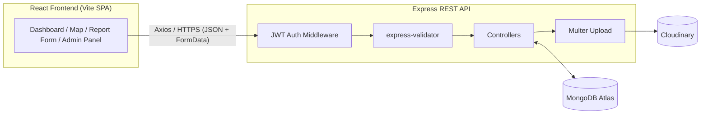
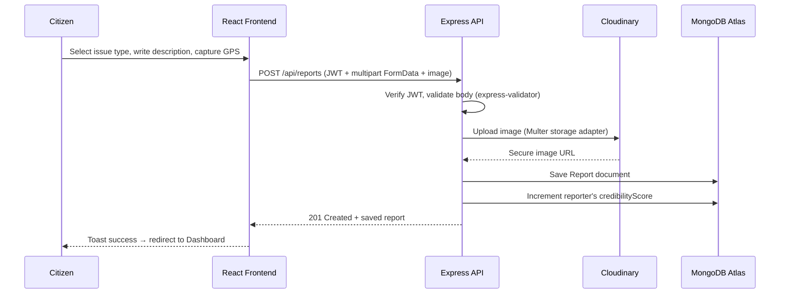
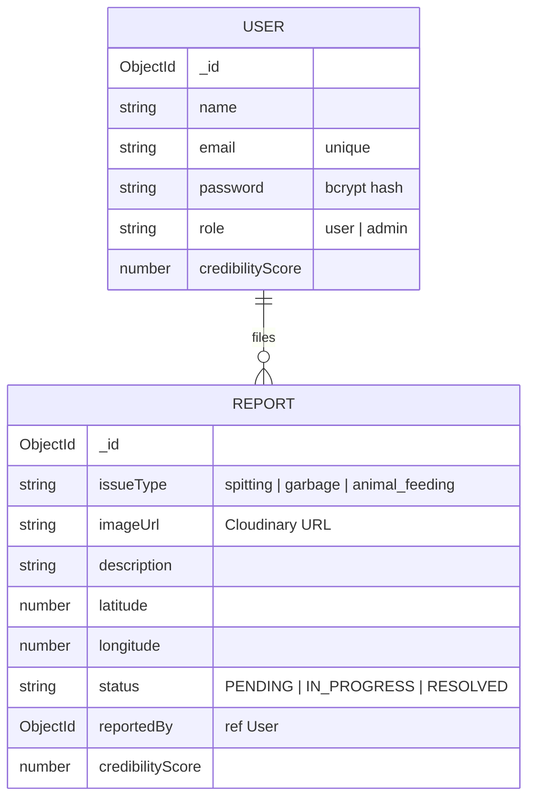
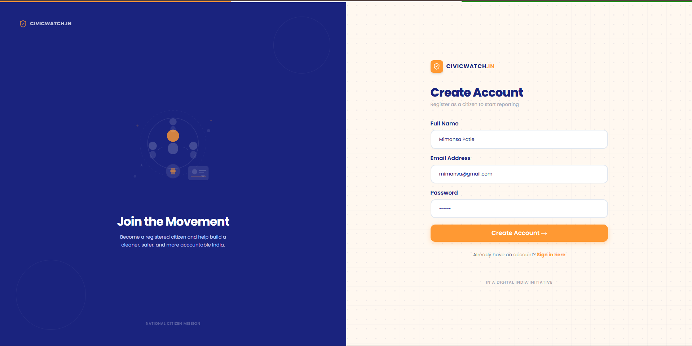
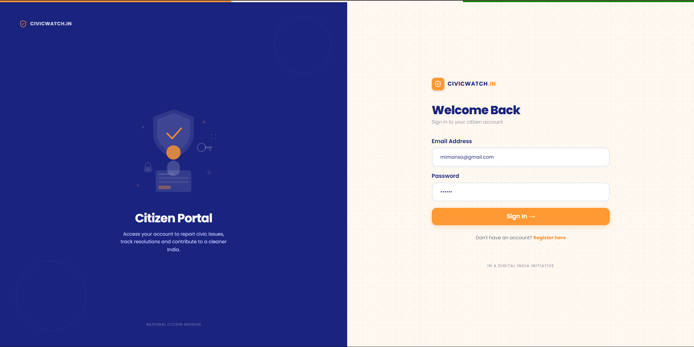
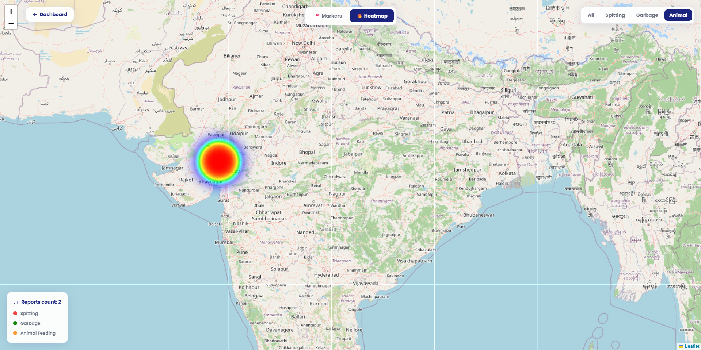
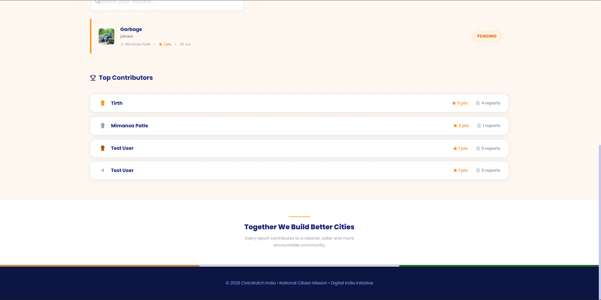
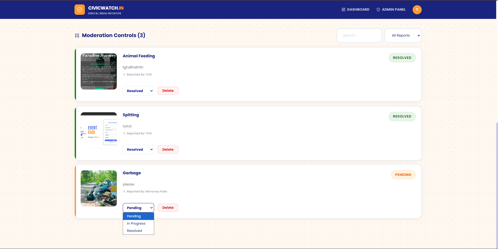

# 🇮🇳 CivicWatch India

**A geo-tagged citizen reporting platform that lets residents photograph and pin civic cleanliness issues on a live map — and gives administrators a single dashboard to triage and resolve them.**

[](https://react.dev)
[](https://vitejs.dev)
[](https://nodejs.org)
[](https://www.mongodb.com/atlas)
[](https://cloudinary.com)
[](https://tailwindcss.com)
[](https://leafletjs.com)

---

## 📑 Table of Contents

1. [About the Project](#-about-the-project)
2. [Problem Statement](#-problem-statement)
3. [Objective & Scope](#-objective--scope)
4. [Key Features](#-key-features)
5. [Tech Stack](#-tech-stack)
6. [System Architecture](#-system-architecture)
7. [Database Design](#-database-design)
8. [Module-wise Breakdown](#-module-wise-breakdown)
9. [API Reference](#-api-reference)
10. [Project Structure](#-project-structure)
11. [Screenshots](#-screenshots)
12. [Getting Started](#-getting-started)
13. [Security Notes](#-security-notes)
14. [Known Limitations & Improvement Areas](#-known-limitations--improvement-areas)
15. [Future Enhancements](#-future-enhancements)
16. [Developers](#-developers)

---

## 📖 About the Project

**CivicWatch India** is a full-stack web application built as a **Digital India Initiative**-styled civic engagement tool. It allows any registered citizen to report public cleanliness violations — **garbage dumping**, **spitting**, and **animal feeding violations** — by capturing a photo and their live GPS location. Every report is plotted on an interactive city map (with a marker and heatmap view), and administrators get a dedicated panel to move each report through a `Pending → In Progress → Resolved` lifecycle.

Active citizens are rewarded with a **credibility score** that feeds a public leaderboard, encouraging sustained community participation.

## 🎯 Problem Statement

Municipal bodies largely depend on manual inspection rounds and word-of-mouth complaints to detect civic nuisances. This causes:

- Delayed detection of recurring problem hotspots (no visual/geographic evidence trail)
- No single source of truth connecting a citizen's complaint to administrative action
- No accountability loop — citizens rarely see whether their complaint was acted upon
- No incentive for citizens to keep reporting once the novelty wears off

## 💡 Objective & Scope

**Objective:** Give any citizen a sub-minute workflow to photograph an issue, auto-tag its GPS coordinates, and submit it for action — while giving administrators a real-time map/heatmap of hotspots and a moderation queue.

**Scope of the current build:**

- Two roles — **Citizen** and **Admin** (role-based routing via `AdminRoute`)
- Three extensible issue categories — `garbage`, `spitting`, `animal_feeding`
- Web-first (responsive, works on desktop and mobile browsers); pilot map is centered on **Raipur, Chhattisgarh**
- Gamified participation via a per-user credibility score and a top-5 leaderboard

## ✨ Key Features

### For Citizens
- 🔐 Secure registration & login (JWT-based sessions, bcrypt-hashed passwords)
- 📸 File a report with photo evidence, issue category, description, and one-tap GPS capture (`navigator.geolocation`)
- 🗺️ Explore all city reports on an interactive **marker-clustered map** or switch to a **heatmap** of hotspots
- 🎛️ Filter map reports by issue type (Spitting / Garbage / Animal Feeding)
- 📋 Track personal report history and status ("My Reports") with live stats (total / resolved / pending)
- 🏆 Earn credibility points per report and climb the public leaderboard
- 🔍 Search/filter through personal report history

### For Administrators
- 📊 At-a-glance stat cards — total reports, pending, in-progress, resolved
- 👥 Citizen account directory with role & credibility score
- 🛠️ Moderation console: search/filter all reports by status, update lifecycle status, or delete a report (with confirmation dialog)
- 🔒 Admin-only routes gated client-side via `AdminRoute`

### Platform-wide
- 🌗 Government-of-India-inspired tricolor design system (navy / saffron / green) built with Tailwind CSS
- 🔔 Toast notifications (`react-hot-toast`) and confirmation modals (`SweetAlert2`) for every mutating action
- ☁️ Image evidence uploaded directly to Cloudinary via Multer storage adapter

## 🛠 Tech Stack

| Layer | Technology |
|---|---|
| **Frontend** | React 19, React Router 7, Vite, Tailwind CSS 3 |
| **Backend** | Node.js, Express 5 |
| **Database** | MongoDB Atlas via Mongoose ODM |
| **Authentication** | JSON Web Tokens (`jsonwebtoken`), `bcryptjs` password hashing |
| **File / Image Storage** | Cloudinary + Multer (`multer-storage-cloudinary`) |
| **Maps & Geospatial** | Leaflet, React-Leaflet, `react-leaflet-cluster`, `leaflet.heat` |
| **Validation** | `express-validator` |
| **UX** | `lucide-react` icons, `react-hot-toast`, `sweetalert2` |

## 🏗 System Architecture



**Report submission flow:**



## 🗄 Database Design



| Model | Field | Type | Notes |
|---|---|---|---|
| **User** | `name`, `email`, `password` | String | `email` unique, `password` bcrypt-hashed |
| | `role` | enum | `user` (default) or `admin` |
| | `credibilityScore` | Number | default `1`, incremented per report filed |
| **Report** | `issueType` | enum | `spitting`, `garbage`, `animal_feeding` |
| | `imageUrl` | String | Cloudinary secure URL, required |
| | `description` | String | free text |
| | `location.latitude/longitude` | Number | captured via browser Geolocation API |
| | `status` | enum | `PENDING` (default) → `IN_PROGRESS` → `RESOLVED` |
| | `reportedBy` | ObjectId ref | links back to `User` |
| | `credibilityScore` | Number | default `1` |

Both schemas use Mongoose `timestamps` (`createdAt` / `updatedAt`).

## 🧩 Module-wise Breakdown

| Module | Description | Key Files |
|---|---|---|
| **Authentication** | Register/login, JWT issuance, bcrypt hashing, role-based access | `authController.js`, `authMiddleware.js`, `Login.jsx`, `Register.jsx` |
| **Report Filing** | Citizens submit issue type, description, GPS location & photo evidence | `CreateReport.jsx`, `reportController.js`, `reportValidator.js`, `upload.js` |
| **Map & Visualization** | Marker-clustered map + heatmap toggle, filter by issue type | `MapPage.jsx` (Leaflet, `react-leaflet-cluster`, `leaflet.heat`) |
| **Citizen Dashboard** | Personal stats, searchable report history, leaderboard preview | `Dashboard.jsx`, `MyReports.jsx` |
| **Gamification / Leaderboard** | `credibilityScore` rewards active reporters; public top-5 leaderboard | `getTopContributors` in `authController.js` |
| **Admin Panel** | Manage citizen accounts, moderate report status & delete reports | `AdminDashboard.jsx`, `AdminRoute.jsx` |
| **Notifications & Feedback** | Toasts and confirmation dialogs for every mutating action | `react-hot-toast`, `sweetalert2` |

## 🔌 API Reference

Base URL: `http://localhost:5000/api`

| Method | Endpoint | Auth | Description |
|---|---|:---:|---|
| `POST` | `/auth/register` | Public | Register a new citizen account |
| `POST` | `/auth/login` | Public | Login — returns JWT + user profile |
| `GET` | `/users` | Public | List all registered users (Admin panel) |
| `GET` | `/top-contributors` | Public | Top 5 users ranked by credibility score |
| `POST` | `/reports` | 🔒 JWT | Create a report (`multipart/form-data`: `issueType`, `description`, `location`, `image`) |
| `GET` | `/reports` | Public | Get all reports (Map view & Admin panel) |
| `GET` | `/reports/:id` | Public | Get a single report by ID |
| `PATCH` | `/reports/:id` | 🔒 JWT | Update a report's status (Admin) |
| `DELETE` | `/reports/:id` | 🔒 JWT | Delete a report (Admin) |
| `GET` | `/my-reports` | 🔒 JWT | Get reports filed by the logged-in citizen |

> 🔒 JWT routes expect an `Authorization: Bearer <token>` header, verified by `middleware/authMiddleware.js`.

## 📂 Project Structure

```
civicwatch-india/
├── civicwatch-backend/            # Node.js + Express REST API
│   ├── config/                    # MongoDB & Cloudinary configuration
│   ├── controllers/                # Route handler logic (auth, reports)
│   ├── middleware/                  # JWT auth guard & Multer upload adapter
│   ├── models/                      # Mongoose schemas — User, Report
│   ├── routes/                      # Express routers
│   ├── validators/                  # express-validator rule sets
│   └── server.js                    # App entry point
│
├── civicwatch-frontend/           # React 19 + Vite single-page app
│   ├── public/                      # Static assets (favicon, banner)
│   └── src/
│       ├── assets/                   # Images used inside components
│       ├── components/               # Navbar, ReportCard, AdminRoute, illustrations/
│       ├── pages/                    # Dashboard, Login, Register, CreateReport, MapPage, MyReports, AdminDashboard
│       ├── services/api.js           # Axios instance (backend base URL)
│       └── styles/                   # Custom map.css + Tailwind config
│
└── screenshots/                   # App screenshots referenced in this README
```

## 📸 Screenshots

| | |
|---|---|
| **Registration**  | **Login**  |
| **Citizen Dashboard**  | **Interactive Map (Markers)**  |
| **Heatmap View**  | **Report Filing Form**  |
| **After Submitting a Report**  | **Leaderboard**  |
| **Admin Dashboard**  | **Report Result / Detail**  |
| **Delete Report (Admin)**  | |

## 🚀 Getting Started

### Prerequisites
- Node.js (v18+) and npm
- A MongoDB Atlas cluster (connection string)
- A Cloudinary account (cloud name, API key, API secret)

### 1. Clone the repository
```bash
git clone <repository-url>
cd civicwatch-india
```

### 2. Backend setup
```bash
cd civicwatch-backend
npm install
```

Create a `.env` file inside `civicwatch-backend/`:
```env
PORT=5000
MONGO_URI=your_mongodb_atlas_connection_string
CLOUDINARY_NAME=your_cloudinary_cloud_name
CLOUDINARY_KEY=your_cloudinary_api_key
CLOUDINARY_SECRET=your_cloudinary_api_secret
JWT_SECRET=your_jwt_secret
```

Run the API server:
```bash
node server.js
```

### 3. Frontend setup
```bash
cd ../civicwatch-frontend
npm install
npm run dev
```

The app opens at the Vite dev URL (typically `http://localhost:5173`) and calls the backend at `http://localhost:5000/api`.

> ⚠️ **Note:** `src/services/api.js` currently hardcodes the API base URL to `http://localhost:5000/api`. If the backend runs on a different port, update that file (or switch it to a Vite env variable) to match.

## 🔐 Security Notes

- Passwords are hashed with `bcryptjs` before storage — plaintext passwords are never persisted.
- Protected routes (`/api/reports` POST/PATCH/DELETE, `/api/my-reports`) require a valid JWT via the `protect` middleware.
- The Admin Panel is additionally gated client-side by `AdminRoute`, which checks `role === "admin"` from the locally stored user object.
- Uploaded evidence images are restricted to `jpg`/`jpeg`/`png` and streamed directly to Cloudinary (never stored on the API server's disk).

## ⚠️ Known Limitations & Improvement Areas

These are natural next steps for a production-grade rollout:

- The JWT signing secret is currently hardcoded in `authMiddleware.js` / `authController.js` rather than read from the `JWT_SECRET` value already present in `.env`.
- The frontend does not currently handle token expiry (a 1-day JWT) — the UI stays in a "logged in" state until the user manually logs out.
- No pagination on `/api/reports` or `/api/users` — fine at demo scale, would need it before city-wide rollout.
- No automated test suite yet (`civicwatch-backend/package.json` only has a placeholder `test` script).

## 📈 Future Enhancements

- 📱 Native mobile application (React Native / Flutter)
- 🔔 Real-time status-change notifications (Socket.io / push / SMS / email)
- 🤖 AI-based image classification to auto-verify issue type and flag duplicate or fake reports
- 🏛️ Government/municipal department integration for automatic report routing
- 📊 Advanced analytics dashboard — hotspot trends by ward/area, average resolution time
- 🌐 Multi-language support for regional Indian languages

## 👩‍💻 Developers

| Role | Name | Program |
|---|---|---|
| **Backend Developer** | Mimansa Patle | B.Tech CSE |
| **Frontend Developer** | Tirth Vaghela | IMSc (IT) |

## ⭐ Project Objective

To encourage citizen participation in maintaining public cleanliness and civic responsibility through a digital, geo-tagged reporting platform that closes the loop between reporting and administrative action.

---

If you found this project interesting, consider giving it a ⭐ on GitHub.
